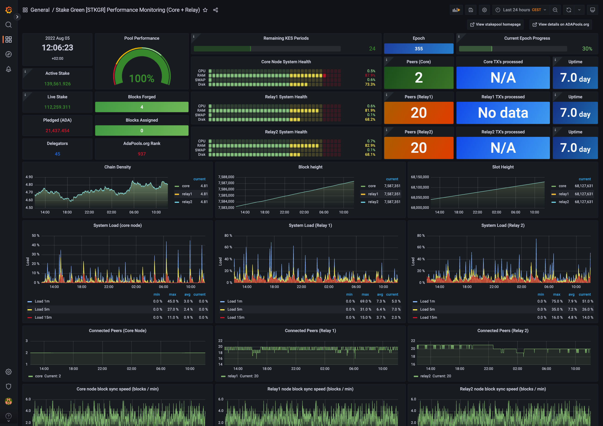
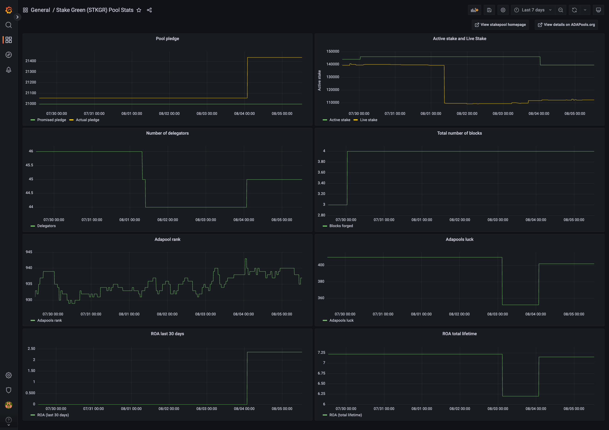

## Stake Green [STKGR] cardano nodes monitoring dashboards
Grafana dashboards created to monitor Cardano Block Producer en Relay nodes and blockchain statistics of your Pool. This setup assumes you are running 2 relay nodes and 1 block producer. 

### Screenshots of dashboards



### Pre-reqs
- Make sure you hava a running cardano block producer node
- Make sure you have a running cardano relay node 
 
### How to use?
- Install Grafana on a server or on your local machine if you prefer that
- Install the clock plugin in Grafana with `grafana-cli plugins install grafana-clock-panel`
- Install Prometheus on the same node / machine as were you are running Grafana. It's also possible to separate these if you prefer. This README assumes it's installed on the same node / machine.
- Install Prometheus node exporter on your block producer and relay nodes

#### Cardano node config
Cardano must be configured correctly so that it is exposing the statistics correctly that you want to display on your dashboard. You can do this by changing the `mainnet-config.json`. Look for `hasPrometheus` and set the following. 
```
    "hasPrometheus": [
        "0.0.0.0",
        12798
    ],
```
<strong>0.0.0.0</strong>: Exposes the data on your external ip address*<br>
<strong>12798</strong>: This is the default port used for exporting the data, you can change this to something you can prefer. 

Restart / start the cardano node.

#### Prometheus node exporter
Prometheus node exporter needs to be running on all of your nodes. Some of the stats in the dashboards are coming from adapools, this only needs to be done on 1 of your nodes. Preferably one of your relays instead of the block producer.
On the node that you chose that is going to get the statistics from Adapools, copy the file `templates/prometheus_node_exporter/get_stats.sh` to a directory of your preference. Make sure you update `{pool_id}` with your own pool id.
Make sure the directory `/var/lib/prometheus/node-exporter/adapools` exists, this is the directory where the stats data is written too. 
<strong>Crontab</strong>:
Make sure that the stats are automatically pulled from Adapools by adding the script to the crontab and make sure it runs every hour. Test the script by triggering it manually with the same user as you use for your crontab.
<strong>Permissions</strong>: Make sure that the crontab user is able to access the `get_stats.sh` file and able to write to `/var/lib/prometheus/node-exporter/adapools` and that prometheus user is able to read the file inside the adapools directory. 

Copy the file `templates/prometheus_node_exporter/prometheus-node-exporter.service` to `/etc/systemd/system/prometheus-node-exporter.service`. Set the port you want to run prometheus node exporter on by changing `prometheus_node_exporter_port`. The default port is 9100 but you can set anything you like.  
Remove `--collector.textfile.directory=/var/lib/prometheus/node-exporter/adapools --collector.textfile` from the file on the node that you are not pulling / want to pull the stats from Adapools.

Restart / start the prometheus node exporter. Verify that the node exporter is running correctly by checking the status. It might be that you still need to change so access rights to the `get_stats.sh` and the `/var/lib/prometheus/node-exporter/adapools` directory to get everything running correctly.

#### Prometheus
After that you have installed Prometheus, copy the file from templates/prometheus/prometheus.yml to /etc/prometheus/prometheus.yml
Fill in the ip addresses and the ports(see above configurations) of your nodes.

Restart / start prometheus.

#### Grafana 
Import the files inside the `templates/grafana/` by going to dashboards and clicking import.

#### Security
Because you have opened `prometheus_node_exporter_port` and the cardano node stats port(default: 12798) you need to make sure they are only accessible from your monitoring node. Make sure you deny all traffic from all other sources on these ports then your monitoring node ip address.(node where Grafana runs)
It is also advisable to close of traffic to your Grafana node on the https port and only make it accessible from the ip address you will use to view your dashboards from. 

#### License
MIT

#### Author Information
This monitoring setup is created by Stake Green. [https://www.stakegreen.com/](https://www.stakegreen.com/) We would like to thank Staking Rocks pool for sharing their Grafana dashboard as we have used that as our starting point.
